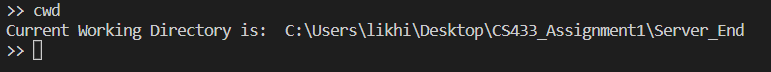

# DESIGN DOCUMENT

This repository contains a simple Remote File System(RFS) service application developed using Socket Programming that supports the client to perform the following five commands:  

| Command        | Description                                                       | Status  |
| ---------------| ------------------------------------------------------------------| ------- |
| cwd            | Retrieve the path of the current working directory of the server  |         |
| ls             | List the files/folders present in the cwd of the server           |         |
| cd 'dir'       | Change the directory to 'dir' as specified by the client          |  OK/NOK |
| dwd 'filename' | Download the 'filename' from server to the client                 |  OK/NOK |
| upd 'filename' | Upload the 'filename' from client to the cwd of server            |  OK/NOK |
 

## File Structure

1. Client_End
    - client.py: Contains the code for the client
    - file_to_upload.txt: The original file that is tested against uploading functionality
    - plain_dwd_file_to_download, substitute_dwd_file_to_download, transpose_dwd_file_to_download: The files downloaded from the server to the client
2. Server_End
    - server.py: Contains the code for the server
    - helper_functions.py: Contains text encryption functions
    - file_to_download.txt: The original file that is tested against downloading functionality
    - upd_file_to_upload.txt: File uploaded from the client to the server

NOTE: client.py and server.py are purposefully built in different folders to understand better movement of files between the client and server
 
 

## Basic Functionality of Client and Server

| Server                                              | Client                                                |
| ----------------------------------------------------| ------------------------------------------------------|
| Creating a TCP socket                               | Creating a TCP socket                                 |
| Binding the socket to HOST and PORT                 |                                                       |
| Waiting for a client connection                     | Connect to the server                                 |
| Server-Client connection establishes                | Server-Client connection establishes                  |
| Follow client's commands until client calls 'exit'  | Take commands from the input and send them to server  |
| If client disconnects, wait for other connections   | Terminate connection on 'exit'                        |

 

##  Layer N Model

**Layer N: File Service**
In this layer, commands are exercised between the client and the server. File Service encrypts(encodes) and decrypts(decodes) data to be exchanged between the client and server using the Crypto Service provided by the N-1 Layer. In addition, this layer uses the OS commands - getcwd(), listdir(), and chdir() are used to perform the commands.
 

**Layer N-1: Crypto Service**
This layer facilitates 3 different  models that can be used by the File Service to encrypt the data to be exchanged between the client and the server before transmitting to the Networking Layer. The three encryption models are:
1. Plain Text: No change in the input
2. Substitute: Alphanumeric characters are encrypted by fixed offset. Ex: *aB3cd* encodes to *cD5ef*
3. Transpose: Reverse the contents in word by word manner. Ex: *abc def* encodes to *cba fed*
 

**Layer N-2: Networking**
In this layer, Transmission Control Protocol(TCP) is used to exchange messages between client and server. It is designed to send packets and ensure the successful delivery of data and messages between client and server.
 

## Commands

**1. cwd**  
Syntax: *cwd*
Functionality: Gives the current working directory of the server
